I'm writing this blog post to jot down why and what I did to self-host Bluesky PDS at my homelab (a server at home).

## Moving away from centralization (like Twitter)

I had been having an urge to self-host Bluesky PDS at Home. I've been hearing good things about Bluesky, but then I don't want to contribute to the centralization / platformism by joining their instance. It's still too fresh in my memory what happened to Twitter.

## Bringing data closer to me

In organizing my digital life, I've been working on to bring data closer to me. Self-hosting Bluesky PDS sounded like a perfect opportunity for me.

## Prerequisites

I had the following before starting this project.

1. A server running at home with Docker. In my case, I ran off from my OpenMediaVault machine (MacBook Air). But looking back, I'd place this in a more isolated environment, since it's a public-facing service. (A dedicated RaspberryPi or a proxmox VM may be a good idea...)
2. A domain you own
3. Cloudflare-account to manage Cloudflare Tunnels

## Where I found information

I did not sit down to come up all of these from my head. I followed The Robbie Davis's excellent tutorial for self-hosting a Bluesky PDS. I mostly followed it, except the part about the reverse proxy (since I'm using a Cloudflare Tunnel).

## Part 1. Configure Docker Compose

Based on the Robbie Davis's, I configured the docker compose file and the .env file as below. I edited the following parts:

1. I re-named the service and container as `bluesky-pds` instead of `pds` so that I can easily identify them later (e.g., when doing `docker ps`)
2. I moved all the environment variables into the compose file (under `environment:`). Then, I refer to them by [environment variable interpolation](https://docs.docker.com/compose/how-tos/environment-variables/variable-interpolation/#interpolation-syntax). I also specify the default values where appropriate, such as for the PDS data directory

### Example compose.yml

```yml
services:
  bluesky-pds:
    container_name: bluesky-pds
    image: ghcr.io/bluesky-social/pds:latest
    restart: unless-stopped
    ports:
      - 3000:3000
    volumes:
      - ./pds:/pds
    environment:
      - PDS_HOSTNAME=${PDS_HOSTNAME}
      - PDS_JWT_SECRET=${PDS_JWT_SECRET}
      - PDS_ADMIN_PASSWORD=${PDS_ADMIN_PASSWORD}
      - PDS_PLC_ROTATION_KEY_K256_PRIVATE_KEY_HEX=${PDS_PLC_ROTATION_KEY_K256_PRIVATE_KEY_HEX}
      - PDS_EMAIL_SMTP_URL=${PDS_EMAIL_SMTP_URL}
      - PDS_EMAIL_FROM_ADDRESS=${PDS_EMAIL_FROM_ADDRESS}
      - PDS_MODERATION_EMAIL_SMTP_URL=${PDS_MODERATION_EMAIL_SMTP_URL}
      - PDS_MODERATION_EMAIL_ADDRESS=${PDS_MODERATION_EMAIL_ADDRESS}
      - PDS_DATA_DIRECTORY=${PDS_DATA_DIRECTORY:-/pds}
      - PDS_BLOBSTORE_DISK_LOCATION=${PDS_BLOBSTORE_DISK_LOCATION:-/pds/blocks}
      - PDS_DID_PLC_URL=${PDS_DID_PLC_URL:-https://plc.directory}
      - PDS_BSKY_APP_VIEW_URL=${PDS_BSKY_APP_VIEW_URL:-https://api.bsky.app}
      - PDS_BSKY_APP_VIEW_DID=${PDS_BSKY_APP_VIEW_DID:-did:web:api.bsky.app}
      - PDS_REPORT_SERVICE_URL=${PDS_REPORT_SERVICE_URL:-https://mod.bsky.app}
      - PDS_REPORT_SERVICE_DID=${PDS_REPORT_SERVICE_DID:-did:plc:ar7c4by46qjdydhdevvrndac}
      - PDS_CRAWLERS=${PDS_CRAWLERS:-https://bsky.network}
      - LOG_ENABLED=${LOG_ENABLED:-true}
```

### Example .env

Below is the example .env file. You need to specify your own values here.

```sh
PDS_HOSTNAME #bluesky.yourdomain.com
PDS_JWT_SECRET #openssl rand --hex 16
PDS_ADMIN_PASSWORD #openssl rand --hex 16
PDS_PLC_ROTATION_KEY_K256_PRIVATE_KEY_HEX #openssl ecparam --name secp256k1 --genkey --noout --outform DER | tail --bytes=+8 | head --bytes=32 | xxd --plain --cols 32
PDS_EMAIL_SMTP_URL #smtp://username@gmail.com:password@smtp.gmail.com:587
PDS_EMAIL_FROM_ADDRESS #admin@domain.com
PDS_MODERATION_EMAIL_SMTP_URL #smtp://username@gmail.com:password@smtp.gmail.com:587
PDS_MODERATION_EMAIL_ADDRESS #admin@domain.com
```

> For my SMTP, I used Postmark. So the SMTP URL looked something like `username:password@smtp.postmarkapp.com:587`

Then, you can run `docker copose up` to start the service. To check, you can access the port 3000 of the server. If you see the following message, you are successfully running the Bluesky PDS.

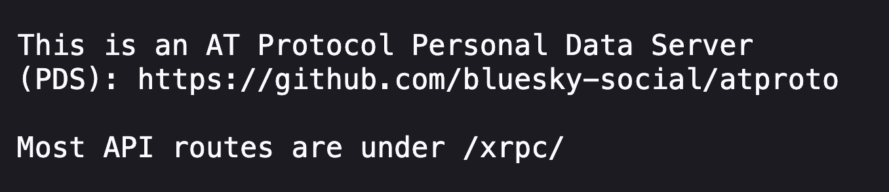

The next step is to expose the service to the Internet, safely!

## Part 2. Exposing your Bluesky PDS via a Cloudflare Tunnel

I usually use Cloudflare tunnels to expose my self-hosted services from my homelab.

> Side note: Some people avoid Cloudflare because all data will pass through Cloudflare, and we need to trust Cloudflare to do good. For my use case, the security and privacy risk of me trying to expose my home lab directly to the internet myself is higher than Cloudflare messing up, so I use Cloudflare Tunnels.

If you are interested in learning more about Cloudflare Tunnels, check out [Syntax.fm's YouTube/Podcast](https://www.youtube.com/watch?v=20rdAb2JpDs&pp=ygUUc3ludGF4IGZtIGNsb3VkZmxhcmU%3D) or [the blog post by I's FOSS](https://itsfoss.com/cloudflare-tunnels/).

### Making sure that your domain is managed by Cloudflare

1. Login or sign-up to [Cloudflare](https://dash.cloudflare.com/).
2. Check if you have your domain added to the account. If not, click "+ Add a domain" to add your domain, and follow the instructions.

### Create a Cloudflare tunnel

1.  Go to [Cloudflare Zero Trust](https://one.dash.cloudflare.com/) (one.dash.cloudflare.com)

2.  Go to Networks → Tunnels <br />
    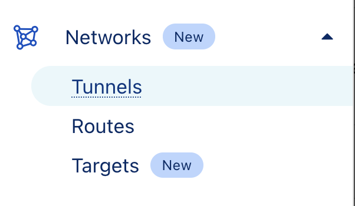
3.  Click "Create a tunnel" <br />
    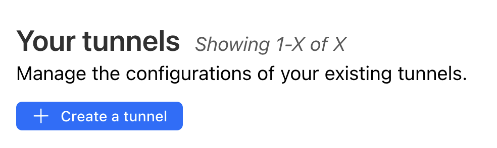

4.  Select Cloudflared <br />
    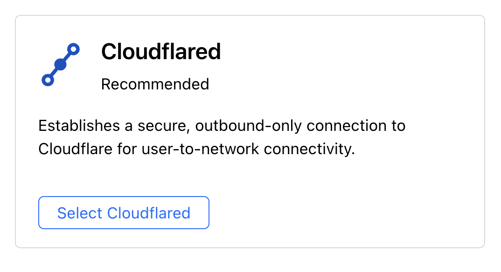

5.  Name your tunnel <br />
    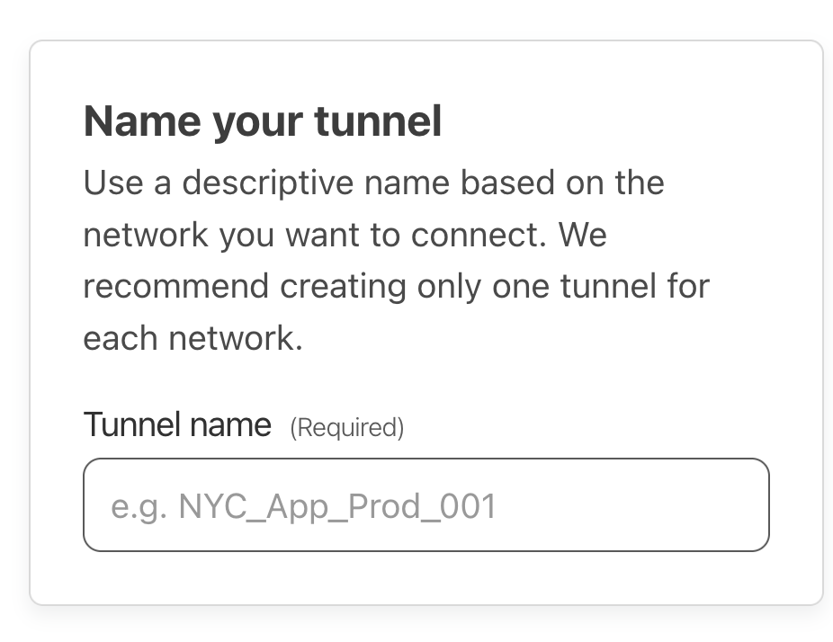

6.  Choose Docker as your environment, and copy the command to run a connector <br/>
    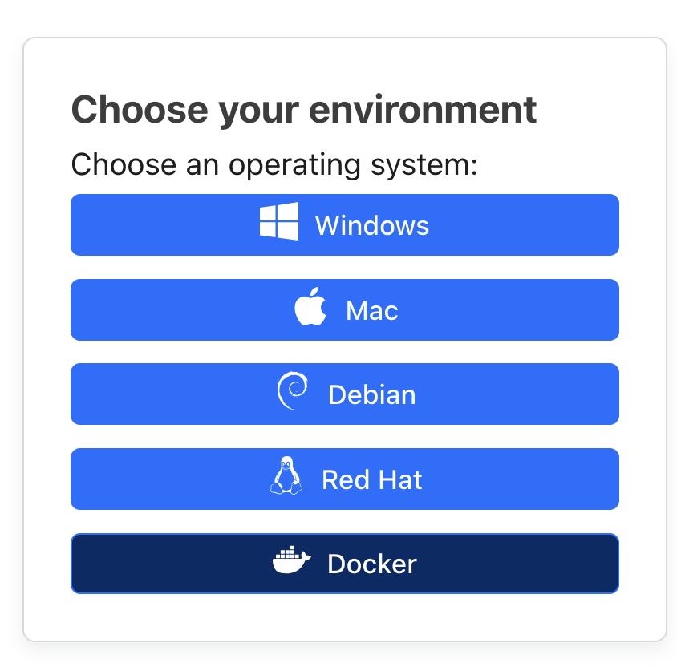
    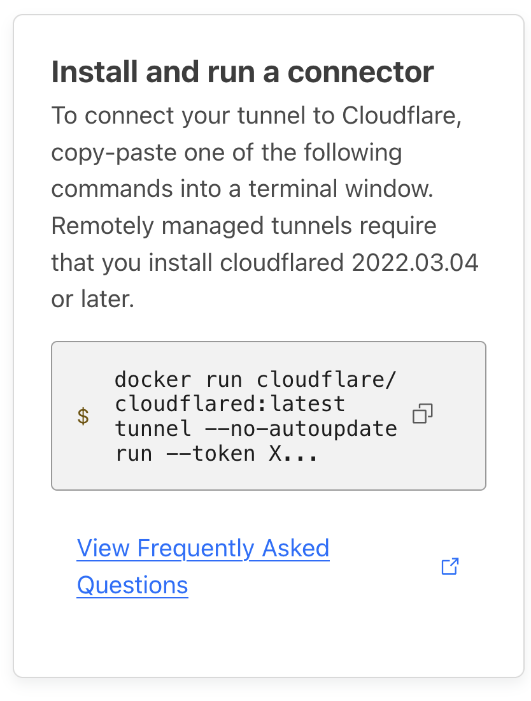 <br/> You can start the connector (`cloudflared`) by running the command. I usually modify the command and add a daemon flag (`-d`) so that it runs in the background, that is:
    `docker run -d cloudflare/cloudflared:latest ...`
    Click "Next"

7.  Configure the public hostname and service

    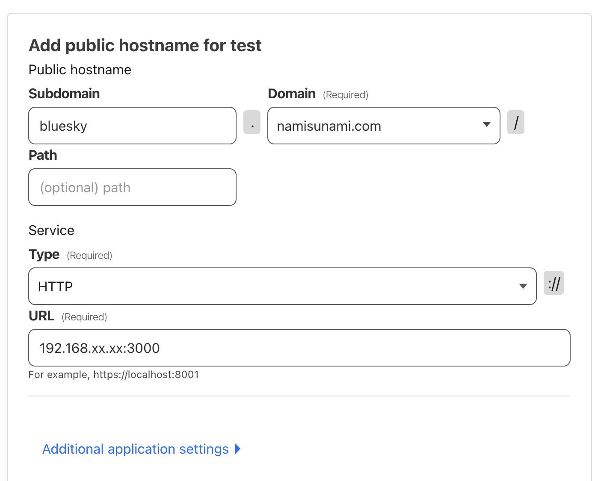

    a. Public hostname: I wanted to host my Bluesky PDS instance on bluesky.namisunami.com. So I set up the following.

    |           |                  |
    | --------- | ---------------- |
    | Subdomain | `bluesky`        |
    | Domain    | `namisunami.com` |
    | Path      | (Empty)          |

    b. Service:
    | | |
    | --------- | ---------------- |
    | Type | `HTTP` |
    | URL | Set the URL to be the IP address of the server plus the port number `3000`. (A local IP address usually starts with 192.168 or 10) Something like: `192.168.99.99:3000` |

8.  Click "Save tunnel"

9.  Go to the public hostname that you configured in above to check if you see the message "This is an AT Protocol Personal Data Server ..."

### Part 3. Creating an Account

Now the server is running! The next step is to create an account on your Bluesky PDS.

But you will need an invitation code from your Bluesky PDS.

#### Get an invitation code

To get an invitation code, you can make a POST request to PDS. You need to use the admin password that you set in your `.env` file.

You can use curl to make a post request like below. Replace the admin password (`PDS_ADMIN_PASSWORD`) and hostname (`YOUR_PUBLIC_HOSTNAME`) with yours

```bash
curl -X POST \
 -u admin:PDS_ADMIN_PASSWORD \
 -H 'Content-Type:application/json' \
 -d '{"useCount": 1}' \
 https://YOUR_PUBLIC_HOSTNAME/xrpc/com.atproto.server.createInviteCode
```

The response will look something like:

```json
{ "code": "bluesky-namisunami-com-abcde-fghij" }
```

#### Create an account on your PDS

1. Open a Blusky client (I used my iOS app)

   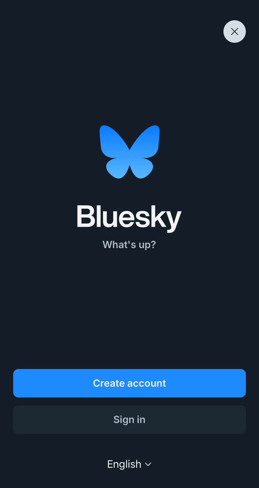

   Select Create account

2. Change hosting provider to the domain that you set <br />
   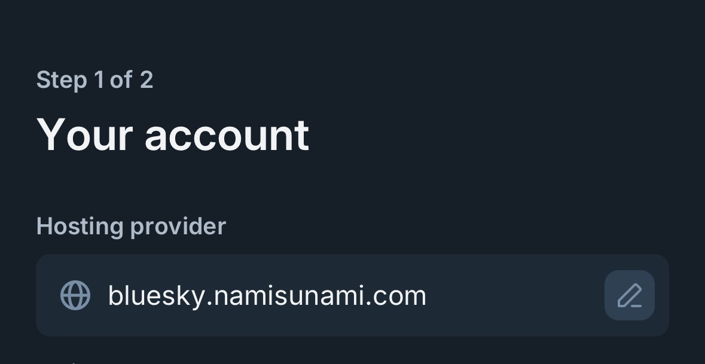

3. Copy and paste the invite code <br/>
   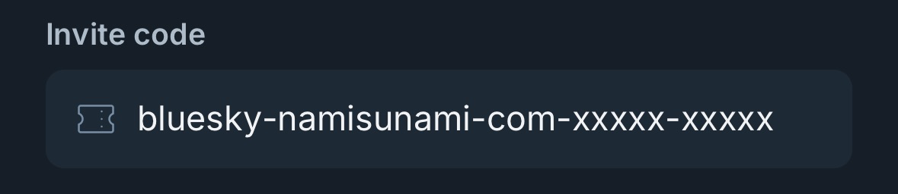

4. Fill in the rest of the information about your account. Click "Next"

5. Set the username. By default, the handle will look like `@your_username.yourdomain.com`. In my case, I wanted my handle to be my top domain name, that is `@namisunami.com`. I will describe the process in the next step. For now, you can put a temporary username here, and you can change it later. Click "Next" </br>
   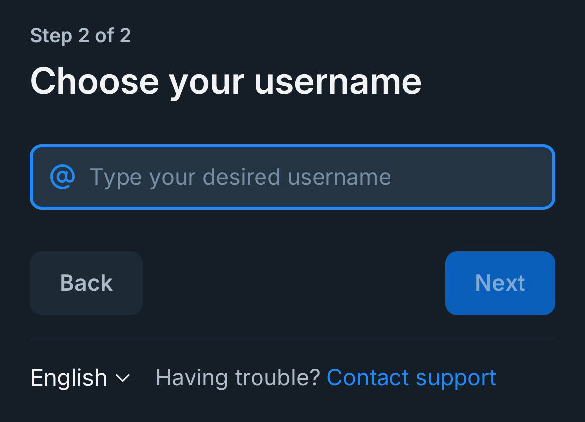 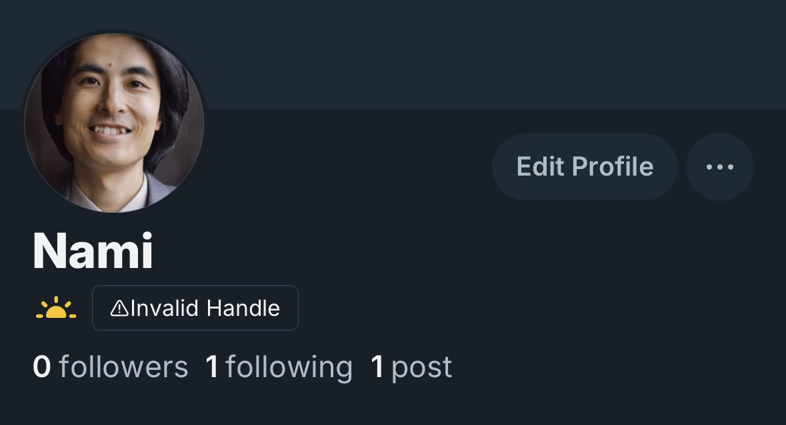

#### Changing the handle


It's because Bluesky looks for a TXT record for the domain to validate the handle.

To change the handle and set up properly:

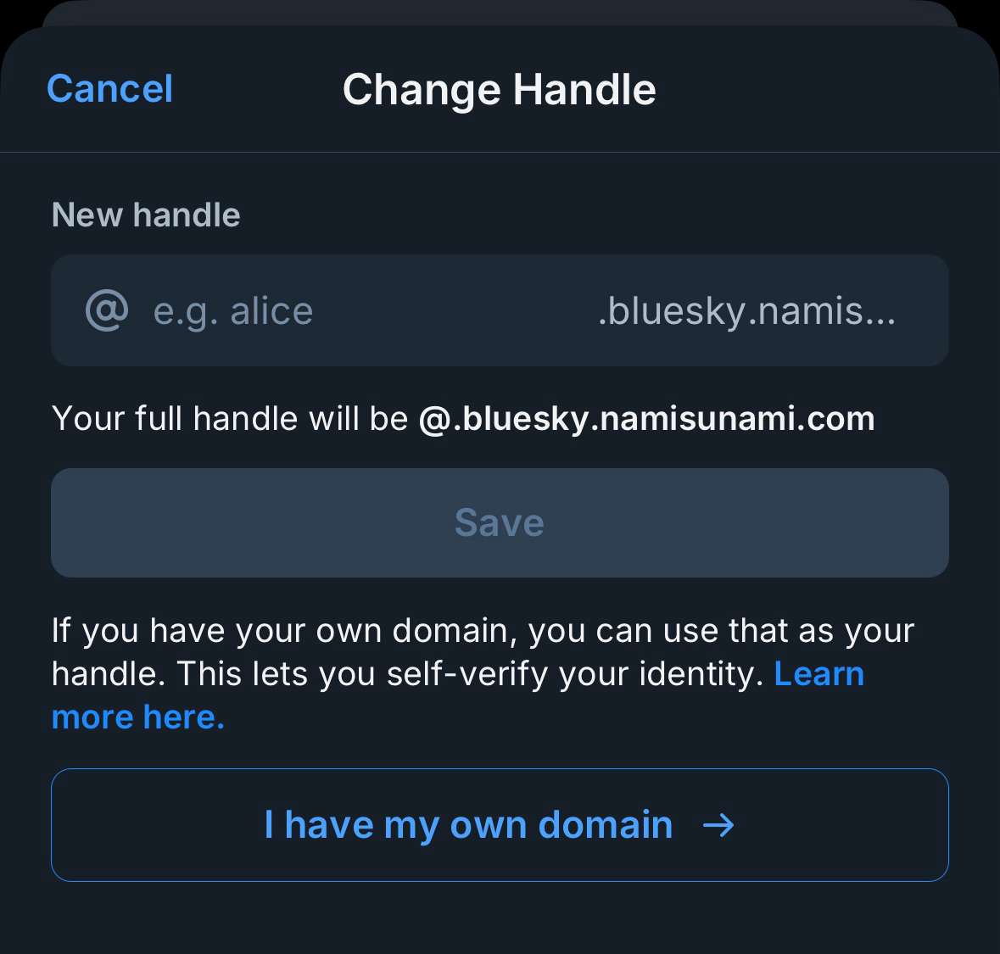

   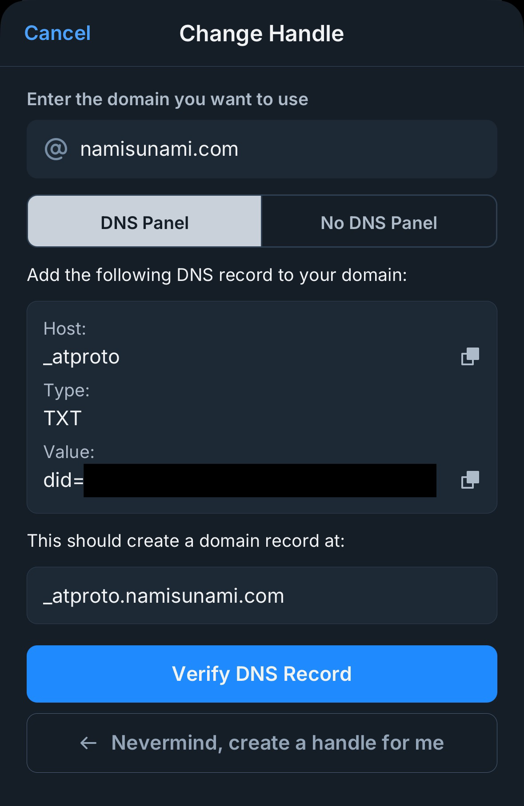

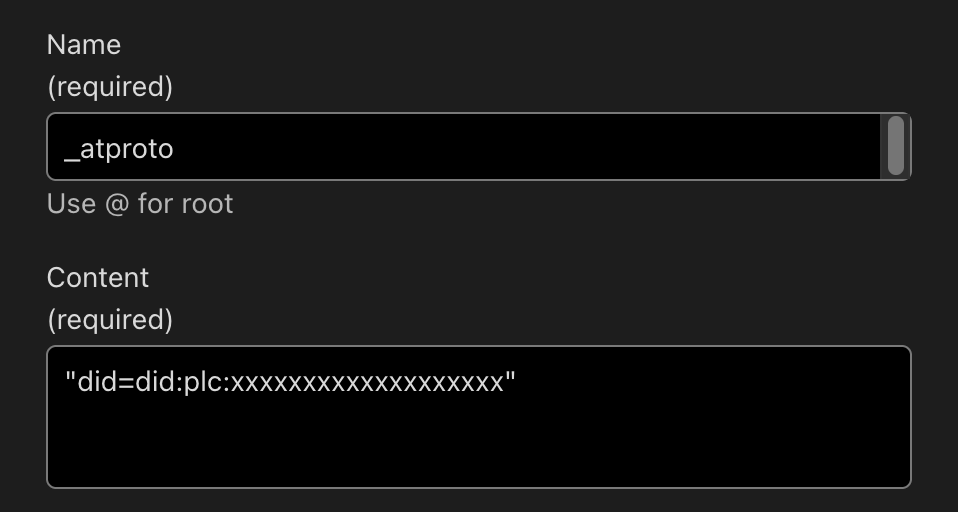

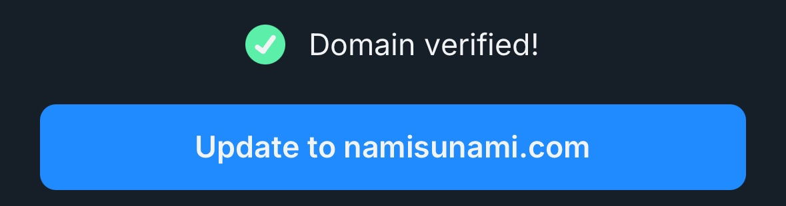

Hope you were able to host your own Bluesky PDS!

If you were, please follow me on [@namisunami.com on Bluesky](https://bsky.app/profile/namisunami.com)

### References

- [Bluesky PDS GitHub repo](https://github.com/bluesky-social/pds)
- [The Robbie Davis | Self-hosting Bluesky PDS using Docker, Cloudflare, and Reverse Proxy with SWAG ](https://therobbiedavis.com/selfhosting-bluesky-with-docker-and-swag/)
