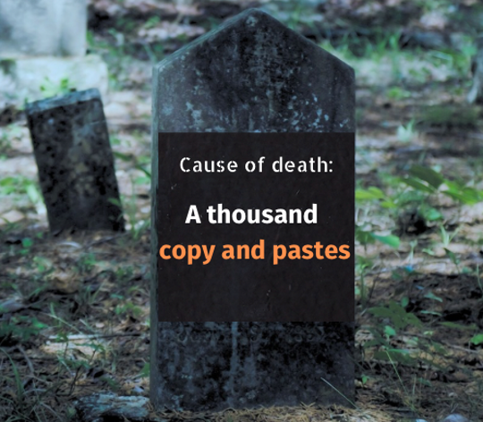
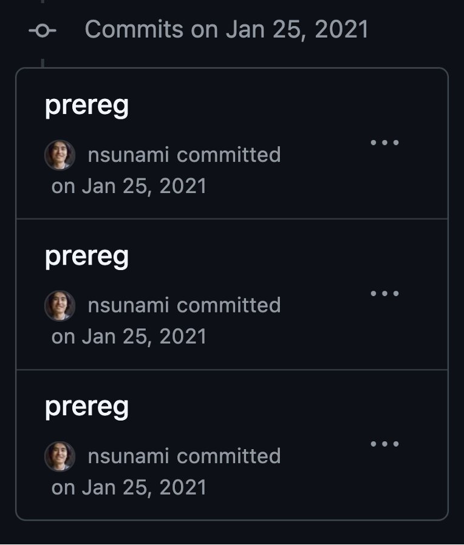
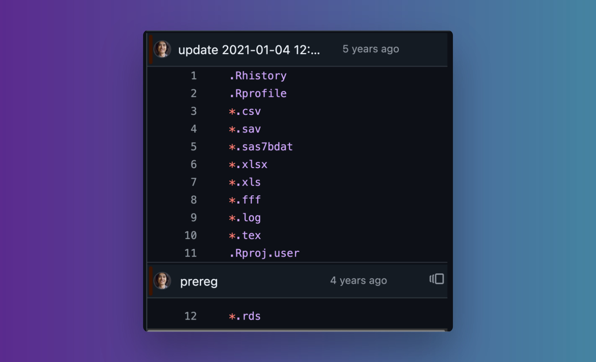
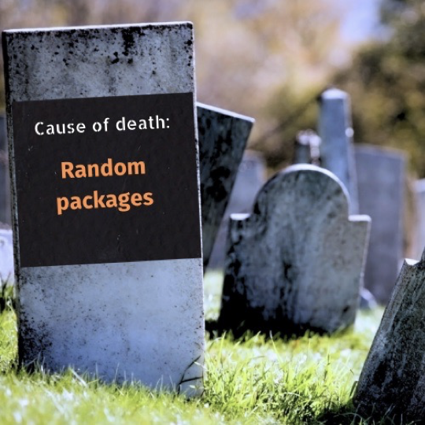
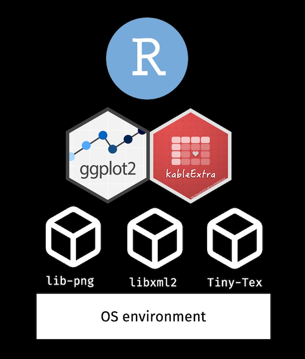

I wrote my PhD dissertation openly on GitHub repo, starting 2020. After 4 years, I found that many things were broken. I also learned many things over time. In this blog post, I share my story of revising my dissertation, finding issues, and fixing them.

## Why I wanted to make my dissertation reproducible

### Trying to say goodbye to Google Doc

I made the first commit to the repository in December 2020. It was after my proposal defense.

Before that, I was using Google Doc for my dissertation. It was available, easy, and sharable: an important feature to get feedback from my advisor and committee members.

But, I was not completely happy. I was passionate about Open Science, and I wanted to do my dissertation in an open manner. After all, a mortal like me can only do one dissertation in a lifetime. I got one shot, and I wanted to have a good one.

### Saving myself from death by a thousand copy-pastes

I was using R to analyze data and Google Docs to write texts. This setup meant that whenever I had updates on analysis from R, I had to copy-paste those outputs to Google Doc. Oh, and I had to follow the APA format for reporting. Like: (_r_(235) = -0.05, _p_ = .466, 95%CI [-0.17, 0.08]), with the italicized letters _r_ and _p_. If anything changed in the analysis, I had to redo the formatting again.

The process was error-prone and tedious. Creating a reproducible manuscript meant that these numbers should automatically be updated if there were any changes. No more death by a thousand copy-pastes.



### Working toward Open Science

Open Science was, and is, core to what I do. By making a self-reproducing dissertation, I share my research process openly, working towards to my passion.

## Starting a GitHub repo

I started my GitHub repo, and I looked for options to create a reproducible thesis.

I first tried [WORCS](https://github.com/cjvanlissa/worcs/) (Workflow for Open Reproducible Code in Science). You can see that in the [first commit](https://github.com/nsunami/dissertation/tree/e4694d2183570c6baaa7099d1dbc33398ac0d753), which is the template Markdown file from WORCS.

But I quickly realized that WORCS was not best for my use case. WORCS was more suited for creating a shorter, article-length publication while I needed a solution to render a dissertation, which is more like a book.

So, I switched to use the combination of [R Markdown](https://rmarkdown.rstudio.com/) and [Bookdown](https://bookdown.org/). Using this setup, I was able to combine the code and writing using the same place, in R.

## Regret 1: Not starting early and small

At this point, I already had my proposal written up. That meant that I already had a good amount of writing in Google Doc. I had to manually import them, and by doing so, I lost the history of the changes in the proposal.

Starting early would have also allowed me more time to develop my _muscles_ to use git, GitHub, and Bookdown to practice the flow. As I mention later, my earlier commit messages are cryptic, and I in the present cannot decode the meaning anymore.

If I had started the repo earlier, I could have started the project smaller in scope. In my case, my entire proposal was ready, and thus came with the dependencies of citations and formatting, which I had to fix while importing. By starting small and early, I could have avoided those issues.

## Regret 2: Not storing data in a data repository

My usual research workflow that time was to store data somewhere in the project directory. So, I created a data folder under the repository, which meant that the data was checked in the git repository.

At that time, I did not think much about it. But, right now, I regret doing so for the following reasons:

1. The data is hidden behind the project, not having a unique identifier (e.g., DOI). The data is not easily findable, and thus not very [FAIR](https://www.go-fair.org/fair-principles/) (And my Data Steward self is not proud of it.)

2. My data files were in binary (the R Data Serialization format in Rds). Any update to the dataset file caused the replacement of the file, which bloated the repo size.

3. By using a data repository, I could have easily tracked the different versions of the data (e.g., on [Zenodo to manage versions](https://help.zenodo.org/docs/deposit/manage-versions/)).

## Regret 3: Not committing with meaningful commit messages

The first few commits of the repo are confusing. Below, you see 3 commits both commented as, "prereg":



I may have had some ideas of what these messages meant in 2021. Now, they are lost forever.

I regret not leaving meaning commit messages.

Nowadays, I try to follow [Conventional Commits](https://www.conventionalcommits.org/en/v1.0.0/) for commit messages (e.g., `feat: add a boxplot for Study 1a`). But, any consistency and additional information can help.

> 💡 During the presentation, my colleague Niek pointed out that it's possible to enforce Conventional Commits messages using pre-commit hooks. I found [conventional-pre-commit](https://github.com/compilerla/conventional-pre-commit) (Python) and [@commitlint/config-conventional](https://github.com/conventional-changelog/commitlint) (JavaScript)

## Dissertation 'done'

Nevertheless, I was able to finish my dissertation, and I defended it in June 2021. I was done with a PhD, and I thought I'd never look at my dissertation again.

## Dissertation strikes back

In 2024, I was at a meeting about a [software management plan](https://zenodo.org/records/7589725). The moderator asked whether anyone had written a research software.

At first, I thought, "I have never done that before." But then, I remembered my dissertation is essentially a software.

I got curious to revisit my dissertation. It's been a long time. But, it should be reproducible.

I cloned my GitHub repo and tried to run my dissertation.

Did it run? Of course not!


Let's see what problems that I had.

## Regret 4: Git-ignoring randomly

When I first tried to run the dissertation, I got an error for missing files. "How is that possible?", I thought. I looked at the gitignore file, and found that I ignored the .csv and .tex files—both of which were used in the project.



"Oh, no... Did I lose data for my project?"

Fortunately, I saved all study-related data in the Rds format, which was not ignored. So, no critical data for my dissertation was lost. The missing .csv file was for rendering the list of measures. And the missing .tex files were for the page for the signature and the layout. I added back the .csv file ([commit](https://github.com/nsunami/dissertation/pull/6/commits/039525acc15481692935e79058db585f145ae696)), and fixed issues for the .tex files ([commit](https://github.com/nsunami/dissertation/pull/6/commits/a3565972352ba9d0f3a6510e8a846c404dbc87bd) & [commit](https://github.com/nsunami/dissertation/pull/6/commits/8b2b4a31e525c7ad73070a3b6253c9b5153def58); [pull request](https://github.com/nsunami/dissertation/pull/6)).

Moral of the story: Don't git-ignore files randomly. Think through the consequences and limit the scope of ignoring, such as ignoring files under certain directories.

## Regret 4: Not keeping track of dependencies

When I was trying to re-run my dissertation, I got errors for missing packages. I wondered, how many package dependencies my dissertation had.

So, I set up the [pak package](https://pak.r-lib.org/) & [renv](https://rstudio.github.io/renv/index.html), and counted dependencies involved (including secondary dependencies).

In total, I had 242 packages. (Too many!)


_Death by random packages_

Dependencies are not only about the R packages. Some R packages require certain software to be installed on the OS, which are called System Requirements. For example, the ggplot2 package depends on clang++ to be installed, which usually exists in common Operating Systems. In contrast, the kableExtra package requires lib-png and libxml2 dependencies, which needs manual installation.

Installing the System Requirements depends on the OS. So in my case, I had to deal with the System Requirements of the 240+ packages, which is a lot. If I had used Docker, I could have taken the snapshot.

A System Requirement for my dissertation also included LaTeX since I was rendering my dissertation into a [PDF](https://github.com/nsunami/dissertation/blob/067c795b48c525609b16efe47c190c7992cb6cd6/Sunami-Dissertation.pdf.pdf). LaTeX also comes with its own packages, which of course gave me an issue when re-running my dissertation.

In summary about the dependencies, I would:

1. Use a package manager to manage packages, such as [renv](https://rstudio.github.io/renv/index.html)
2. Use Docker to take a snapshot of the dependencies. I created a Docker image based on the RStudio image from rocker, installed dependencies

## Regret 6: Not using Docker earlier

My final regret about my dissertation was not using Docker earlier. As I mentioned, I could have avoided issues by taking a snapshot of the OS environment, system dependencies, R packages, and the R and RStudio itself.



## Dissertation now

I worked on these issues, and I feel happy with the state of the dissertation.

I also converted from using RMarkdown and Bookdown to using Quarto, which simplified the dependencies ([FAQ for R Markdown Users](https://quarto.org/docs/faq/rmarkdown.html)).

Overall, I'm most proud that my dissertation replicates simple, 3 lines of code:

```bash
git clone https://github.com/nsunami/dissertation.git
cd dissertation
docker compose up
```
