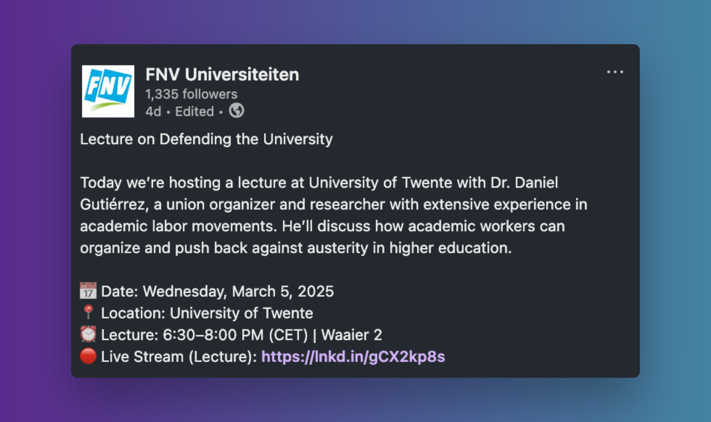

Last week, I came across with [this livestreaming event on LinkedIn](https://www.linkedin.com/events/buildingthepowertodefendtheuniv7302989743204548608/):

After the event, I posted on socials ([Mastodon](https://akademienl.social/@nsunami/114110986038437647), [Bluesky](https://bsky.app/profile/namisunami.com/post/3ljnioul6dc2n), [LinkedIn](https://www.linkedin.com/posts/nsunami_lecture-on-defending-the-university-today-activity-7303124938280906754-y-_6)). And, I wanted to post it here on my blog:

---

What an inspirational livestream! As a former graduate student in the US who was involved in an unionizing movement, I resonated with many points. Below are my takeaways from the lecture:

1. Cultivate your identity as a worker. You provide valuable work, and you can use that as your leverage to make a positive change.

2. Don't keep hoping things will get better. Stop being on the sidelines. Now is the time to act.

3. Don't go alone. You cannot affect decision-makers yourself. When you combine and coordinate actions with others, you have a leverage to negotiate.

4. Use a democratic process to start organizing. Talk about what the problems are, what solutions would be, and what steps can be taken. The goal is to make an actionable plan to present to decision-makers. "We unionists don't hope. We plan."

5. Look for the leverage that does two things at the same time: (1) defend the position that we still have, and (2) undermine the opponent of the strategy and their own survival. One way to do so is by partnering with civil society actors (e.g., associations, churches, NGO's, patient organizations). By doing so, you can undermine the narrative that the university is useless. Communicate the value of university education clearly.

Thank you, Daniel Gutiérrez and [FNV Universiteiten](https://www.fnv.nl/cao-sector/overheid/onderwijs-onderzoek/universiteiten) for the event!

---

I will follow up this post to reflect more on (1) my attempt to start a union in the US as a PhD student, (2) my move to the Netherlands to finally join one, and (3) my worries about unions in the Netherlands. 👋
