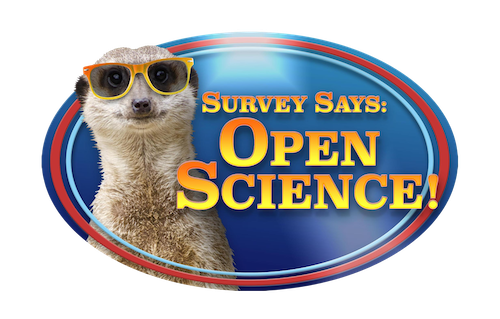
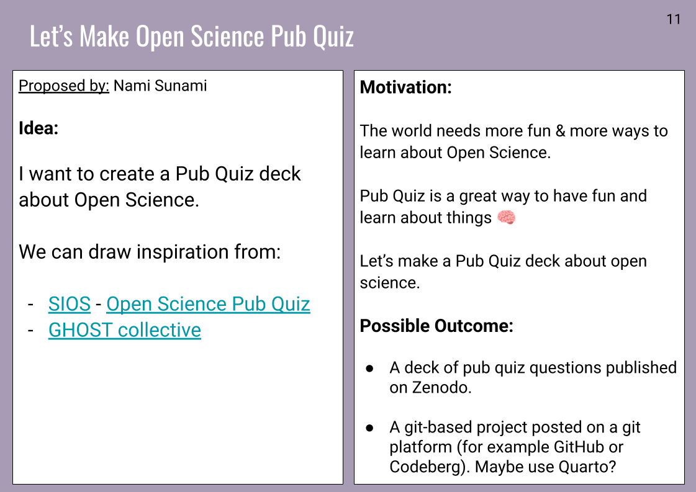
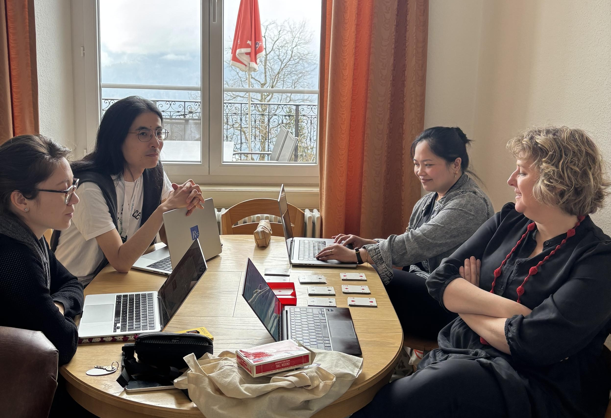
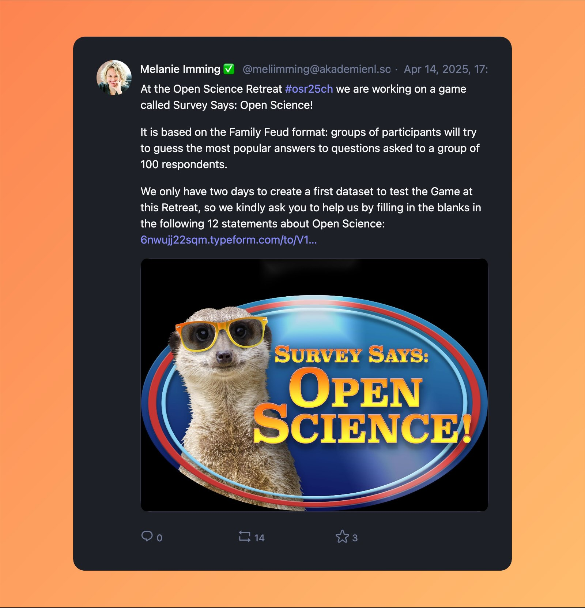
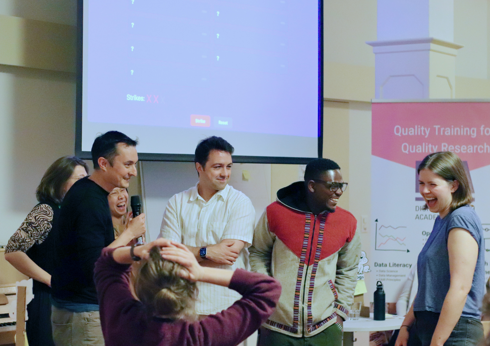
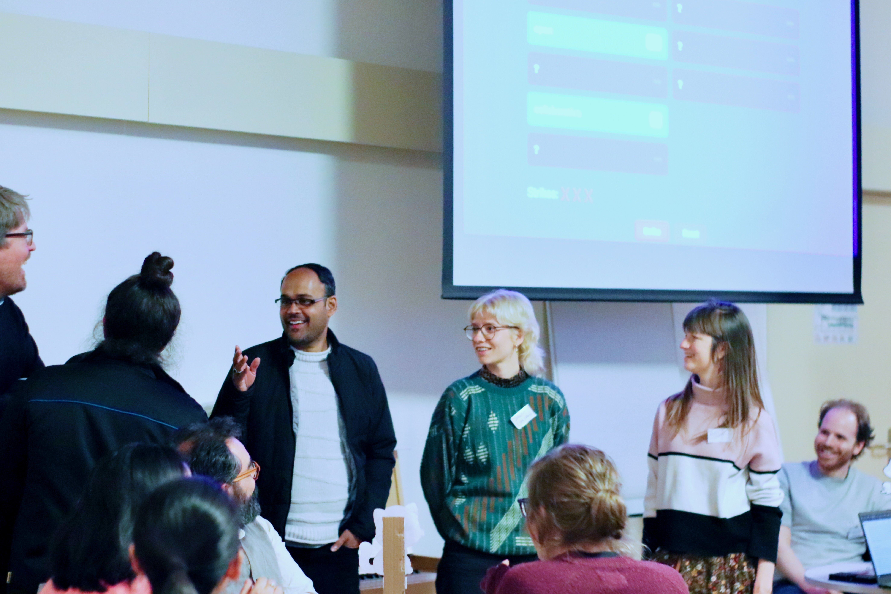
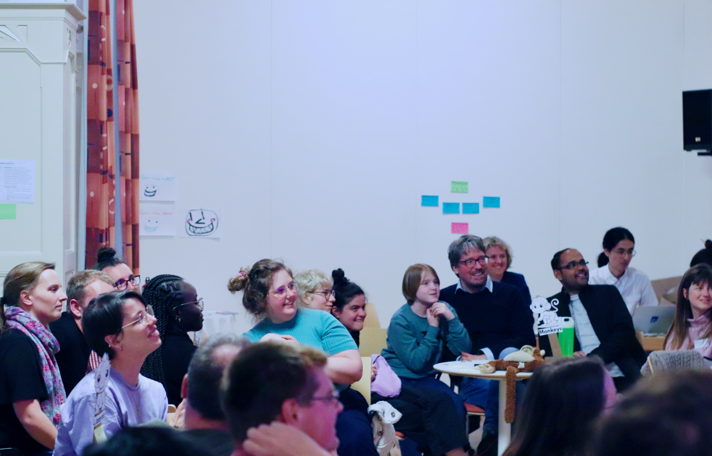
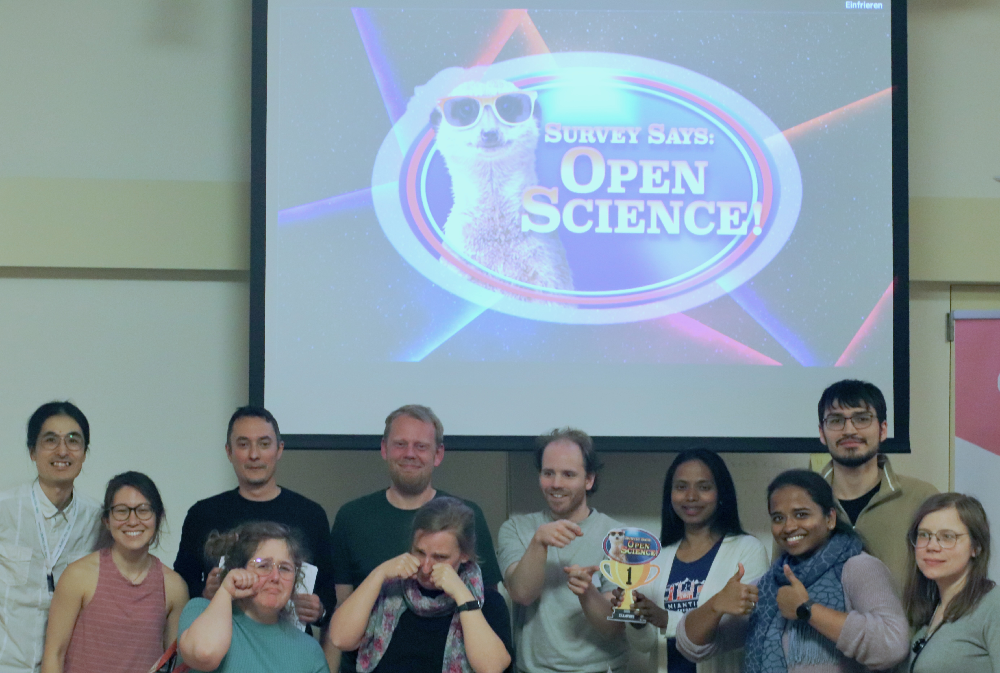

## tl;dr

I joined the [Open Science Retreat](https://open.science-retreat.org/) 2025 in Beatenberg, Switzerland. I went there with a little wish to create an Open Science-themed pub quiz. Little did I know what a great adventure it was to undertake with my teammates.

## Proposing to Create a Pub Quiz

Open Science Retreat is an unconference, a conference without a set agenda. Participants propose topics on the spot. Joining this year's edition, I suggested creating a pub quiz about Open Science. We need more ways to learn about Open Science while having fun, after all. Below is the slide that I created to pitch my idea.

> 👋 Shoutout to Student Initiative for Open Science Amsterdam for sharing me the [slide decks](https://drive.google.com/drive/folders/12-RcaM2LXbluoyIzJi5_qqC7poyWrgYw) for their [pub quiz](https://studentios.org/open-science-pub-quiz-april-30th-2020/)

## From a Pub Quiz to a "Family Feud" Game

[Melanie Imming](https://www.immingimpact.eu/), [Mariana Menegon](https://orcid.org/0009-0000-4655-5528), and later [Jazelle Carillo](https://jazellemaira.design/), joined the group with me. And I was not prepared for the good ride. Melanie pointed out that a pub quiz question always has a correct answer. But the world of Open Science is full of "it depends". For example, when asked about the most important value in Open Science, some may answer reproducibility, and others may say knowledge equity ([Fecher & Friesike, 2014](https://doi.org/10.1007/978-3-319-00026-8_2)). Both of these answers are correct as being voices in the community. We wanted a game that can celebrate different perspectives and facilitate conversations about Open Science.

We found the format of [Family Feud](https://en.wikipedia.org/wiki/Family_Feud) suitable. In Family Feud, the host does a survey beforehand to a group of 100 respondents (for example, "Name a house that you never want to be in"). The host uses the survey responses to make the list of popular answers. Then, the contestants try to guess the popular answers during the game (for example, "Haunted House"). We thought we can use this format to highlight different voices in the Open Science community.

[
_Photo: Digital Research Academy_
](https://mastodon.social/@digiresacademy/114341326732260627)

## Creating Survey Says: Open Science!

We decided to play the game on the last night of the retreat with the retreat participants. So, we only had about 2.5 days to prepare. We named the game, "Survey Says: Open Science!" and started preparing.

### Creating Survey Questions

The first task was to create survey questions. We came up with the following questions:

1. Open Science is driven by \_\_\_\_\_\_\_\_\_

1. In order to make Science more open, we need to reward \_\_\_\_\_\_\_\_\_

1. The most hurtful consequence of Gold Open Access is \_\_\_\_\_\_\_\_\_

1. I like my community to be \_\_\_\_\_\_\_\_\_

1. \_\_\_\_\_\_\_\_\_ is the most important value for Open Science

1. Please talk \_\_\_\_\_\_\_\_\_ to me!

1. University rankings are good for \_\_\_\_\_\_\_\_\_

1. Open Science, just Science \_\_\_\_\_\_\_\_\_

1. Citizens play the role of \_\_\_\_\_\_\_\_\_ in Science

Melanie created a Typeform survey, and we asked people to answer it:

In the short time, we received 77 responses. Thank you to those who responded to the survey!

### Grouping and Coding Survey Answers

We could not use the survey responses as-is because people can write in answers in slightly different ways. The challenge was to determine how to group answers together. We wanted to avoid having too many groups, but also making answers too generic. For example, for the question, "In order to make science more open, we need to reward \_\_(blank)\_\_", people answered "data sharing" and "code sharing". They are both about Open Science practices, so we grouped them into a bigger category, "OS practices (data / code sharing, preregistration)".

There is no one way to group and code survey answers. I believe if others try to code the same data, there may be other ways to group. That's an opportunity to enjoy the game with the same survey responses but different groupings.

### Designing for the Day - Bidding System

Usually, Family Feud is a game for two groups (two families) with 5 contestants each. The game begins with a face-off between the 2 groups. There were around 40 retreat attendees (excluding the Survey Says team). We wanted to let everyone in the retreat to be able to participate in the game. To achieve this goal, we divided the attendees into 8 groups with 5 members each and set up a bidding system.

At the start of the game, all groups received virtual money—90 QPF (Question Processing Fee) to use for the bidding. As the round began, the host revealed one survey question. The groups then decided how much to bid for the round. Once the bids were placed, the group with the highest bid guessed the answers to the survey question. The correct guesses were revealed on the screen, while every wrong guess received a strike. If the group got 3 strikes, their turn ended, and the team with the next highest bid got their chance to guess a correct answer. The group that guessed three answers for the survey question won the round.

## Hosting the Game

We recruited [Gorka González](https://gorka.science/) as a host of the game, and he did a wonderful job as a host. (Thanks Gorka!). You can see how fun it was in the pictures below.

## Open for Possibilities

I did not expect developing a Family Feud game or having such fun together. Then I realized that it was an Open Science Retreat after all. We were creating a culture of openness—for new ideas, for collaborating, and for having a good time together.

## Materials Available Online

Interested in learning more? Do you want to host your own game? Check out our [ResearchEquals Module](https://doi.org/10.53962/h3c8-k99f) for all the materials. The source code of the webapp is available on [my GitHub repo](https://github.com/nsunami/survey-says-open-science).
