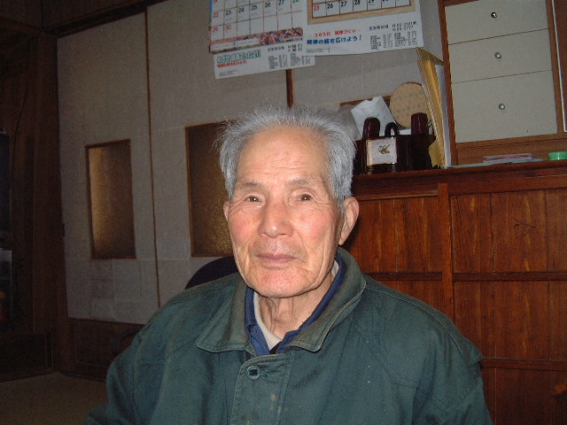

Eighty years ago today, many Japanese people were in front of a radio, waiting for a special announcement from Emperor Hirohito. The broadcast was announced the day before, and people were told not to miss it.

At noon, the broadcast started. The emperor announced that Japan was surrendering in the war. People realized that the war was ending at last.

My grandfather was 29 years old back then. I wonder what he thought about the broadcast.

He went to war several times as a logistics officer in China. He never mentioned his experience with war to people around him, even to his daughter who is my mother.

I wanted to hear his experience about the war. So one day, I brought my laptop with maps and asked him where he was and what his experience was.  He told me that he departed from Kure in Japan and landed to Qingdao in China. But, he did not want to continue. Well, rather, he could not—because he was overwhelmed by the sadness. I don't know what he was remembering. But, I could see the scars of war through his eyes.

He passed away some years ago at the age of 104. I still ask myself, should I have asked more about his experience? That would have been emotional burden to him. But only way that I can know was from him. Who bears the emotional burden of telling stories about the war?

Today is 15 August 2025. Oji-chan, war is still happening around the world. I carry your scars with me. I want to make steps to bring peace to the world for you.

